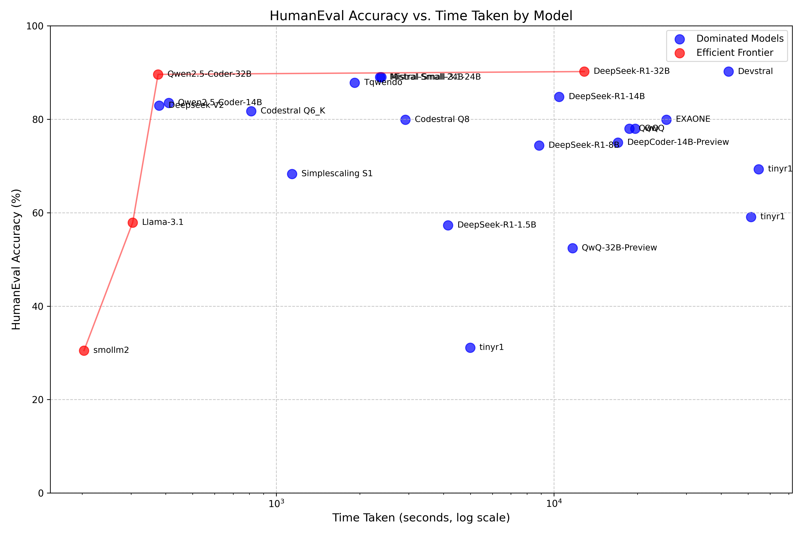

## HumanEval on a local 3090 results



Unless otherwise specified:
- maximum number of layers offloaded to GPU
- local models run with llama.cpp server and .gguf formats
- parameter changes carried over into following tests (temperature, penalties, etc.)
- `*` denotes non-local for comparison

| Model                 | Configuration                                                                    |  Human Eval | Time taken |
|-----------------------|----------------------------------------------------------------------------------| -----------:|-----------:|
| GPT-4*                | Instruction-style, `temperature=0.2`, `presence_penalty=0`                       |      63.4%  |            |
| GPT-4*                | Completion-style                                                                 |      84.1%  |            |
| Mixtral8x7b           | mixtral-8x7b-v0.1.Q5_K_M.gguf                                                    |      45.7%  |            |
| Mistral-medium*       |                                                                                  |      62.2%  |            |
| Llama2*               | HF API, CodeLlama-34b-Instruct-hf                                                |      42.1%  |            |
| Mistral-large*        |                                                                                  |      73.2%  |            |
| WizardLM2             | WizardLM-2-8x22B.IQ3_XS-00001-of-00005.gguf                                      |      56.7%  |            |
| Wizardcoder           | wizardcoder-33b-v1.1.Q4_K_M.gguf, `temperature=0.0`                              |      73.8%  |            |
| Wizardcoder-Python    | Q4_K_M. quant, Modified prompt                                                   |      57.3%  |            |
| CodeFuse-Deepseek     | CodeFuse-DeepSeek-33B-Q4_K_M.gguf                                                |      68.7%  |            |
| Deepseek              | deepseek-coder-33b-instruct.Q4_K_M.gguf                                          |      79.9%  |            |
| OpenCodeInterpreter   | ggml-opencodeinterpreter-ds-33b-q8_0.gguf, -ngl 40                               |     Failed  |            |
| Deepseek              | ggml-deepseek-coder-33b-instruct-q4_k_m.gguf                                     |      78.7%  |            |
| Deepseek              | deepseek-coder-33b-instruct.Q5_K_M.gguf, -ngl 60, a bit slow                     |      79.3%  |            |
| Llama3*               | together.ai API, Llama-3-70b-chat-hf                                             |      75.6%  |            |
| DBRX*                 | together.ai API, dbrx-instruct                                                   |      48.8%  |            |
| CodeQwen              | codeqwen-1_5-7b-chat-q8_0.gguf                                                   |      83.5%  |            |
| Llama3-8B             | bartowski/Meta-Llama-3-8B-Instruct-GGUF                                          |      52.4%  |            |
| Phi-3-mini            | 4k context, 4bit quantized                                                       |      60.4%  |            |
| Phi-3-mini            | 4k context, fp16 quantized                                                       |      62.2%  |            |
| Hermes-Llama          | Hermes-2-Pro-Llama-3-Instruct-Merged-DPO-F16                                     |      53.7%  |            |
| Codestral Q6_K        | Codestral-22B-v0.1-hf.Q6_K.gguf                                                  |      81.7%  |    812.53s |
| Codestral Q8          | Codestral-22B-v0.1-hf.Q8_0.gguf                                                  |      79.9%  |   2918.51s |
| Deepseek V2           | DeepSeek-Coder-V2-Lite-Instruct-Q8_0_L.gguf                                      |      82.9%  |    378.86s |
| Llama-3.1             | Meta-Llama-3.1-8B-Instruct.Q8_0_MaziyarPanahi.gguf                               |      57.9%  |    304.09s |
| Qwen2.5-Coder-14B     | Qwen2.5-Coder-14B-Instruct-Q8_0.gguf                                             |      83.5%  |    409.90s |
| Qwen2.5-Coder-32B     | Qwen2.5-Coder-32B-Instruct-Q4_K_M.gguf                                           |      89.6%  |    375.33s |
| QwQ-32B-Preview       | QwQ-32B-Preview-Q4_K_L.gguf                                                      |      52.4%  |  11660.46s |
| DeepSeek-R1-1.5B      | DeepSeek-R1-Distill-Qwen-1.5B-Q6_K_L.gguf, `temperature=0.6`                     |      57.3%  |   4154.71s |
| DeepSeek-R1-8B        | DeepSeek-R1-Distill-Llama-8B-Q8_0.gguf, `temperature=0.6`                        |      74.4%  |   8836.76s |
| DeepSeek-R1-14B       | DeepSeek-R1-Distill-Qwen-14B-Q6_K_L.gguf, `temperature=0.0`                      |      84.8%  |  10444.61s |
| DeepSeek-R1-32B       | DeepSeek-R1-Distill-Qwen-32B-Q4_K_M.gguf, `temperature=0.6`                      |      90.2%  |  12861.13s |
| Mistral-Small-24B     | Mistral-Small-24B-Instruct-2501-Q6_K.gguf                                        |      89.0%  |   2365.32s |
| Simplescaling S1      | simplescaling_s1-32B-Q5_K_S.gguf                                                 |      68.3%  |   1140.21s |
| Tqwendo               | tqwendo-36b-Q4_K_L.gguf                                                          |      87.8%  |   1916.67s |
| smollm2               | smollm2-1.7b-instruct-q4_k_m                                                     |      30.5%  |    203.09s |
| tinyr1                | tinyr1-32b-preview-q4_k_m                                                        |      31.1%  |   4992.37s |
| QwQ                   | QwQ-32B-Q4_K_M, `max_tokens=10000`                                               |      78.0%  |  19609.10s |
| QwQ                   | QwQ-32B-Q4_K_M, `temperature=0.6`, `max-tokens=10000`                            |      78.0%  |  18689.78s |
| tinyr1                | tinyr1-32b-preview-q4_k_m, `max-tokens=10000`                                    |      59.1%  |  51286.32s |
| tinyr1                | tinyr1-32b-preview-q4_k_m, `temperature=0.6`, `max-tokens=10000`                 |      69.3%  |  54596.08s |
| EXAONE                | EXAONE-Deep-32B-Q4_K_M, `temperature=0.6`, `top-p=0.95`, `max-tokens=10000`      |      79.9%  |  25417.01s |
| Mistral-Small-3.1-24B | mistralai_Mistral-Small-3.1-24B-Instruct-2503-Q6_K_L                             |      89.0%  |   2390.45s |
| DeepCoder-14B-Preview | agentica-org_DeepCoder-14B-Preview-Q6_K_L, `temperature=0.6`, `max-tokens=10000` |      75.0%  |  16987.95s |
| Devstral              | Devstral-Small-2505-Q4_K_M, `start-problem=163`                                  |      90.2%  |  42544.20s |
| Qwen3.5-27B           | Qwen3.5-27B-Q4_K_M, `max-tokens=10000`                                           |      98.2%  |   3953.13s |
| Qwen3.5-35B-A3B       | Qwen3.5-35B-A3B-Q4_K_M (MoE, 3B active), `max-tokens=10000`                      |      96.3%  |   1289.29s |

## LiveCodeBench

| Model               | Configuration                                                  | Version |       Score | Time taken |
|---------------------|----------------------------------------------------------------|---------|------------:|-----------:|
| smollm2             | smollm2-1.7b-instruct-q4_k_m                                   | LCBv5   |       4.2%  |    259.23s |
| QwQ                 | QwQ-32B-Q4_K_M                                                 | LCBv5   |       0.0%  |   5196.35s |
| Devstral            | Devstral-Small-2505-Q4_K_M, `start-problem=34`                 | LCBv5   |       8.6%  |  57268.14s |
| Qwen3.5-27B         | Qwen3.5-27B-Q4_K_M, `max-tokens=10000`                         | LCBv5   |       8.8%  |            |
| Qwen3.5-35B-A3B     | Qwen3.5-35B-A3B-Q4_K_M (MoE, 3B active), `max-tokens=32000`   | LCBv5   |      65.5%  |   5139.25s |

## DeepSeek-R1 Distilled HumanEval Results

| Model Size | Temperature | Frequency Penalty | Accuracy  | Deathloops | Avg. Chars | Speed (s) |
|-----------:|------------:|------------------:|----------:|-----------:|-----------:|-----------:|
| 1.5B       | 0.0         | 0.0               | 50.6%     | 2          | 946        |  4,442    |
| 1.5B       | 0.6         | 0.0               | 57.3%     | 1          | 1,003      |  4,155    |
| 1.5B       | 0.0         | 1.0               | 56.1%     | 0          | 417        |  5,501    |
| 1.5B       | 0.6         | 1.0               | 50.6%     | 0          | 792        |  4,828    |
| 14B        | 0.0         | 0.0               | 84.8%     | 1          | 759        |  10,445   |
| 32B        | 0.0         | 0.0               | 85.4%     | 0          | 603        |  15,655   |
| 32B        | 0.6         | 0.0               | 90.2%     | 0          | 698        |  12,861   |
| 32B        | 0.0         | 1.0               | 75.6%     | 0          | 645        |  17,182   |

```
Using the following quants from @Bartowski:
  1.5B: Qwen-1.5B-Q6_K_L.gguf
  14B: Qwen-14B-Q4_K_M.gguf
  32B: Qwen-32B-Q4_K_M.gguf
Deathloop is a response over 15k chars
```

## API Results

| Model              | Configuration                                                  | Human Eval | Time taken |
|--------------------|----------------------------------------------------------------|-----------:|-----------:|
| gpt-4o-2024-11-20* | Don't respond with anything but code.                          |     86.2%  |    174.97s |
| gpt-4o-2024-11-20* |                                                                |     94.5%  |    661.51s |
| Claude 3.5 Sonnet  | OpenRouter                                                     |     95.1%  |   1673.41s |
| Deepseek-R1        | OpenRouter                                                     |     31.1%  |  15359.62s |
| Deepseek-R1        | OpenRouter. "Don't respond with anything but code"             |     79.3%  |   9819.20s |
| Deepseek-R1        | api.deepseek.com                                               |     97.6%  |   7625.37s |
| o3-mini            |                                                                |     96.3%  |   1140.21s |
